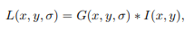
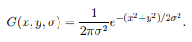
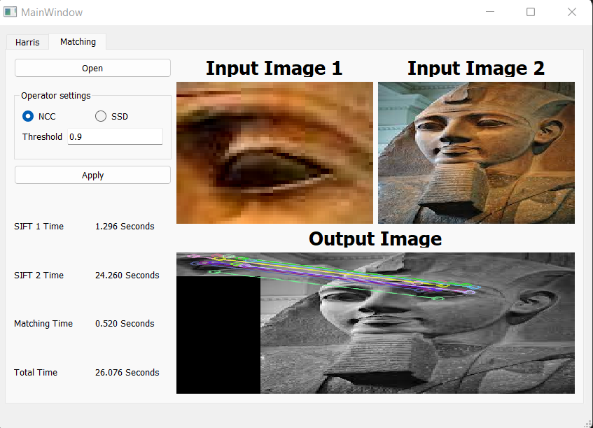
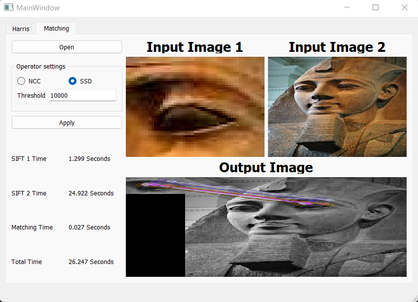

# Feature extraction 
For given set of images (grayscale and color). we can extract the unique features in all images using Harris operator and λ-, generate feature descriptors using scale invariant features (SIFT), and matching the image set features using sum of squared differences (SSD) and normalized cross correlations.

---

## Team Work:

| Name | SEC | BN |
| ----------- | ----------- | ----------- |
| Ahmed Sayed | 1 | 4 |
| Zeyad Khaled | 1 | 35 |
| Abdelrahman Gamal | 1 | 46 |
| Abdallah Mohamed  | 1 | 49 |
| Amr Mohamed | 2 | 5 |

# Setup
1. From the command line create a virtual environment and activate.
```sh
# Windows
> python -m venv .venv
> .venv\Scripts\activate

# Linux
> python3 -m venv .venv
> source .venv/bin/activate
```

2. Install the dependencies.
```sh
> pip install -r requirements.txt
```

3. Run the application.
```sh
> python 
```

## Harris operator

```
apply_harris(img, k = 0.05, threshold = 0.01)
```
#### Parameters:
* threshold: is the percentage of max of haris operator, it must be a float number between 0 and 1
* k: Sensitivity factor to separate corners from edges.
* 
#### Implementation

we implement a code for using harris operator to extract the features from images.


```
def apply_harris(img, k = 0.05, threshold = 0.01):
    img_gray = cv2.cvtColor(img, cv2.COLOR_BGR2GRAY)
    kernel_x = np.array([[-1, 0, 1],[-2, 0, 2],[-1, 0, 1]])
    kernel_y = np.array([[1, 2, 1], [0, 0, 0], [-1, -2, -1]])
    I_x = sig.convolve2d(img_gray, kernel_x, mode='same')
    I_y = sig.convolve2d(img_gray, kernel_y, mode='same')
    Ixx = ndi.gaussian_filter(I_x**2, sigma=1)
    Ixy = ndi.gaussian_filter(I_y*I_x, sigma=1)
    Iyy = ndi.gaussian_filter(I_y**2, sigma=1)

    # determinant
    detM = Ixx * Iyy - Ixy ** 2
    # trace
    traceM = Ixx + Iyy
        
    harrisR = detM - k * traceM ** 2
    img_copy = np.copy(img)
    img_copy[np.where(harrisR>threshold*harrisR.max())] = [255,0,255]
   
    return img_copy
```

#### Result


## scale invariant features (SIFT)
Scale Invariant Feature Transform, is a feature detection algorithm in Computer Vision.
you can finde SIFT Class at libs/sift.py all the code in the class are built based on the [Lowe's paper](https://www.cs.ubc.ca/~lowe/papers/ijcv04.pdf)

### Constructing a Scale Space




1. get the number of ocatves based on the image shape 

```
compute_number_of_octaves(base_image.shape) 
```
2. for each image in one octave we generate the corresponding

```
generate_gaussian_segmas(sigma, num_intervals)
```
3. applying the Gaussian Blur for each image 

```
generate_gaussian_images(base_image, num_octaves, gaussian_segmas)
```
4. enhance the features using Difference of Gaussians or DoG

```
generate_DoG_images(gaussian_images)
```
### Keypoint Localization
1. locate the local maxima and minima

```python
localize_extremum_via_quadratic_fit(self, i, j, image_index, octave_index, num_intervals, dog_images_in_octave, sigma, contrast_threshold, image_border_width, eigenvalue_ratio=10, num_attempts_until_convergence=5) # i , j the index of the pixel
```
2. Orientation Assignment

```python
compute_key_points_with_orientations(
                                    keypoint, octave_index, gaussian_images[octave_index][localized_image_index])
# gaussian_images[octave_index][localized_image_index] is the images in the ocatve
```
1. Calculate the magnitude and orientation

```
compute_gradient_at_center_pixel(self, pixel_array)
``` 
   2. Create a histogram for magnitude and orientation
```
compute_hessian_at_center_pixel(self, pixel_array)
```
### generate the Keypoint Descriptors

```
generate_descriptors(keypoints, gaussian_images)
```
all the above steps wrapped buy the following function 

```
computeKeypointsAndDescriptors(self,sigma=1.6, num_intervals=3, image_border_width=5)
```
# Feature matching 
## 1) algorothms explanations:
### a) SSD:
#### this algorithm is dependent on minimizing the error ( Difference ) between pixels, so the lower the value the higher the matching.
### b) NCC:
#### this algorithm is the opposite to the prev. one, it is dependent on maximizing the correlation between pixels, so the higher the correlation the higher the matching.
## 2) Results for Feature matching
### there are 2 params. for the gui in this part, selecting the mode( "NCC","SSD" ), and select the threshold(for SSD: [0,inf[, for NCC: [-1,1] )
### for our test case we used threshold 10000 for SSD, and 0.9 for NCC.



