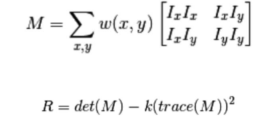
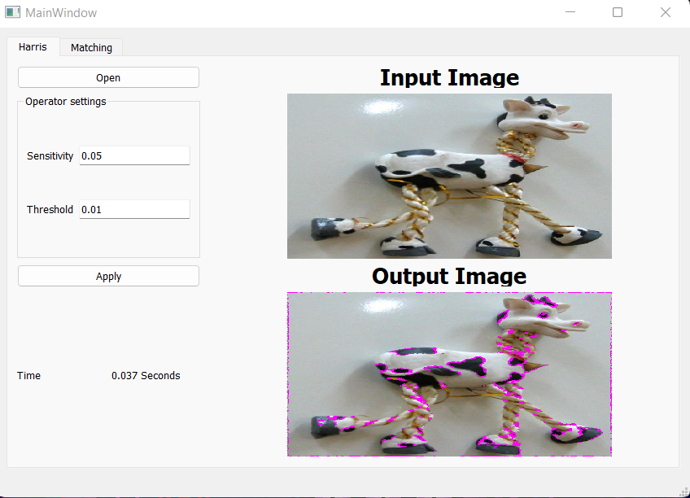

# image-extract-features
For given set of images (grayscale and color). we can extract the unique features in all images using Harris operator and λ-, generate feature descriptors using scale invariant features (SIFT), and matching the image set features using sum of squared differences (SSD) and normalized cross correlations.

---

## Team Work:

| Name | SEC | BN |
| ----------- | ----------- | ----------- |
| Ahmed Sayed | 1 | 4 |
| Zeyad Khaled | 1 | 35 |
| Abdelrahman Gamal | 1 | 46 |
| Abdallah Mohamed  | 1 | 49 |
| Amr Mohamed | 2 | 5 |

## Harris operator

```
apply_harris(img, k = 0.05, threshold = 0.01)
```
#### Parameters:
* threshold: is the percentage of max of haris operator, it must be a float number between 0 and 1
* k: Sensitivity factor to separate corners from edges.
* 
#### Implementation

we implement a code for using harris operator to extract the features from images.


```
def apply_harris(img, k = 0.05, threshold = 0.01):
    img_gray = cv2.cvtColor(img, cv2.COLOR_BGR2GRAY)
    kernel_x = np.array([[-1, 0, 1],[-2, 0, 2],[-1, 0, 1]])
    kernel_y = np.array([[1, 2, 1], [0, 0, 0], [-1, -2, -1]])
    I_x = sig.convolve2d(img_gray, kernel_x, mode='same')
    I_y = sig.convolve2d(img_gray, kernel_y, mode='same')
    Ixx = ndi.gaussian_filter(I_x**2, sigma=1)
    Ixy = ndi.gaussian_filter(I_y*I_x, sigma=1)
    Iyy = ndi.gaussian_filter(I_y**2, sigma=1)

    # determinant
    detM = Ixx * Iyy - Ixy ** 2
    # trace
    traceM = Ixx + Iyy
        
    harrisR = detM - k * traceM ** 2
    img_copy = np.copy(img)
    img_copy[np.where(harrisR>threshold*harrisR.max())] = [255,0,255]
   
    return img_copy
```

### Result


